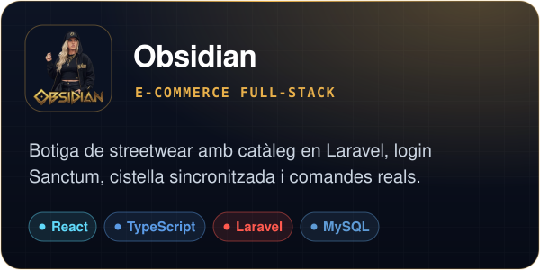
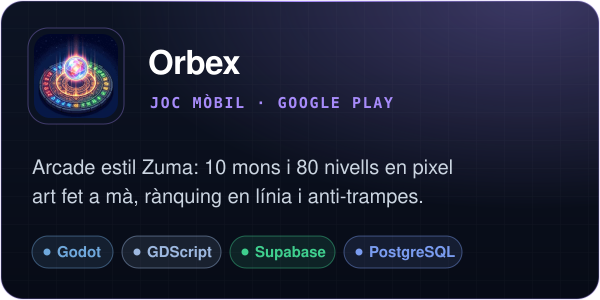
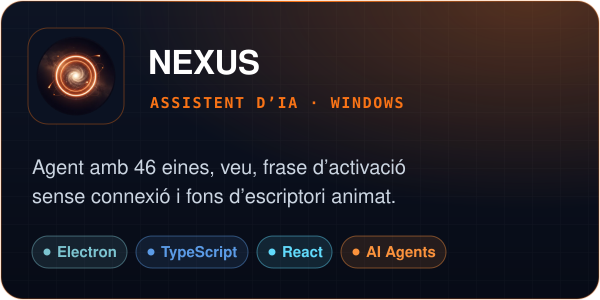
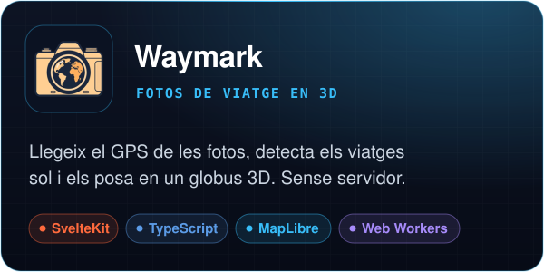
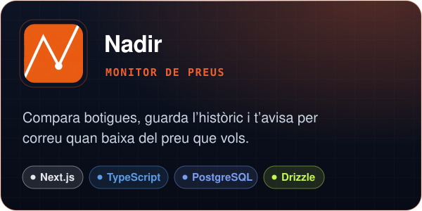
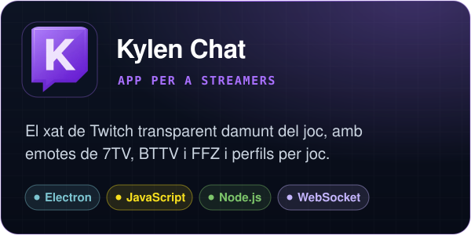
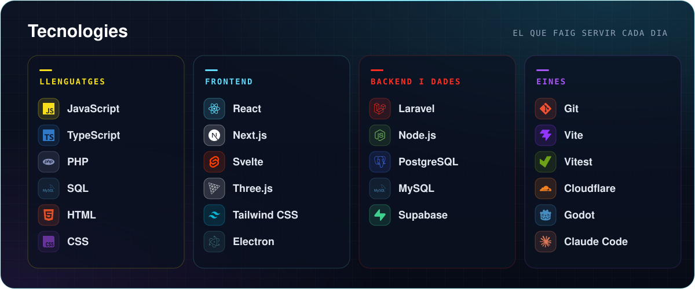
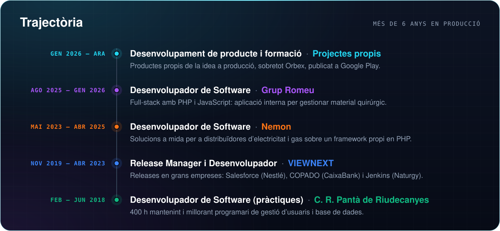
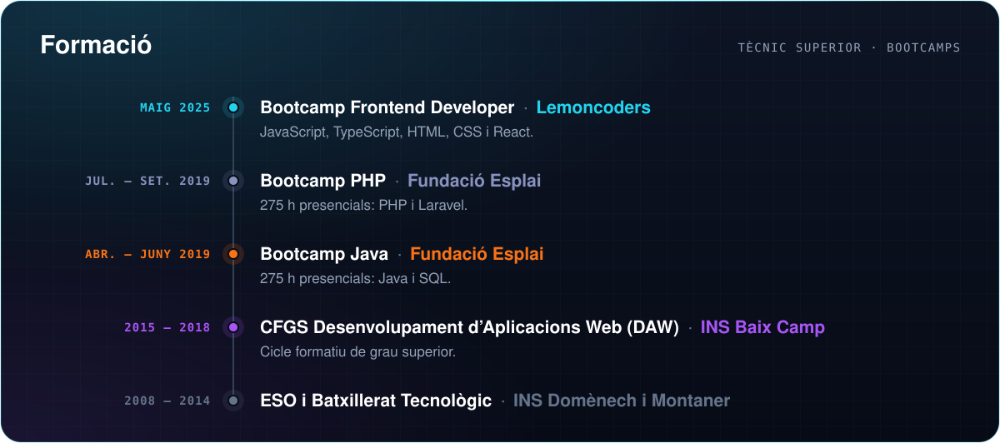

  
  
  

  
  
  

### Sobre mi

Desenvolupador de programari amb més de 6 anys d'experiència professional. He treballat amb **PHP i JavaScript** en
projectes que van des de solucions a mida per a distribuïdores d'electricitat i gas fins a aplicacions internes full-stack. Ara porto els meus
propis productes **de la idea a producció**: una botiga full-stack, un joc publicat a Google Play, un assistent d'IA
per a Windows i diverses apps web desplegades.

M'importa el que no es veu en una demo: la seguretat, el rendiment mesurat, els tests i que el producte aguanti en
mans d'usuaris reals.

 

## Projectes destacats

  
  
   
   
  &nbsp;&nbsp;
   

  
  
   
   
  &nbsp;&nbsp;
   

  
  
   
   
  &nbsp;&nbsp;
   

Més projectes, amb captures i detalls tècnics, a <a href="https://aleixaj.com"><b>aleixaj.com</b></a>

   
   
  

<b>Parlem?</b>

  
  
  

