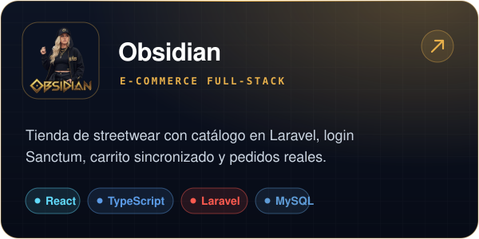
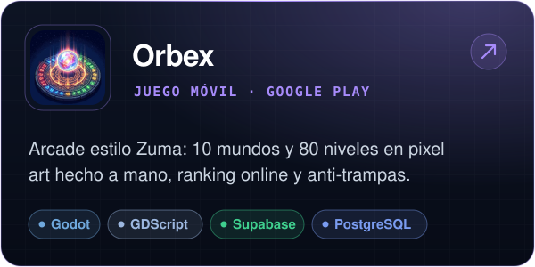
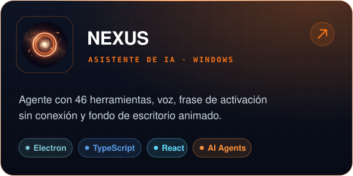
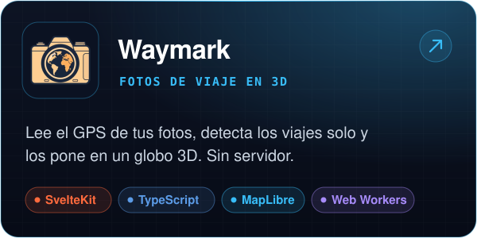
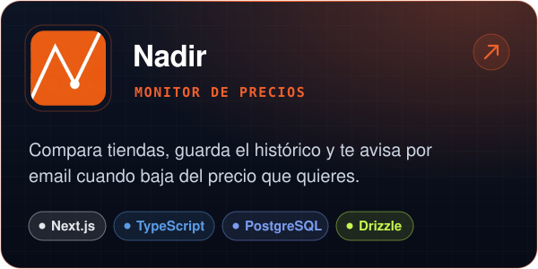
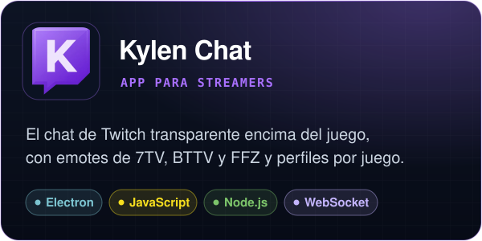
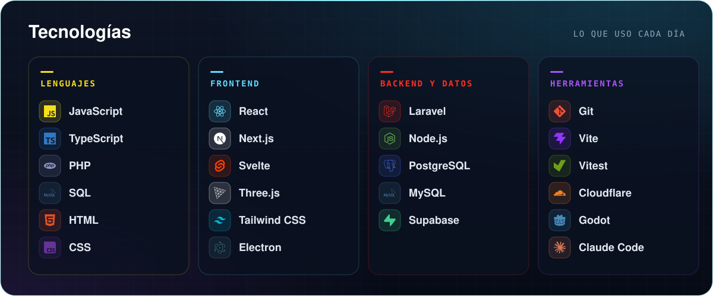
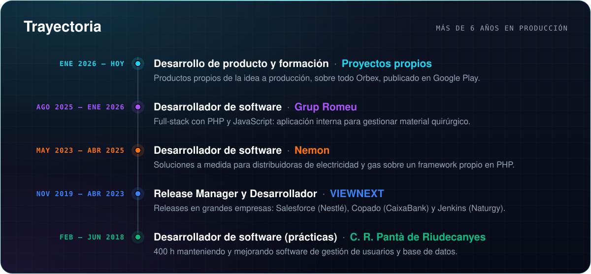
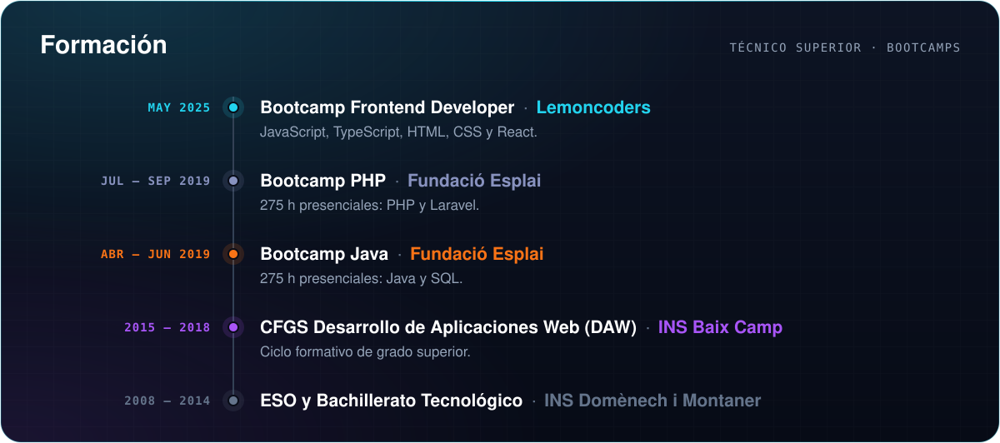

  
  
  

  
  
  

### Sobre mí

Desarrollador de software con más de 6 años de experiencia profesional, trabajando con **PHP y JavaScript**, desde
soluciones a medida para distribuidoras de electricidad y gas hasta aplicaciones internas full-stack. Ahora llevo mis propios
productos **de la idea a producción**: una tienda full-stack, un juego publicado en Google Play, un asistente de IA
para Windows y varias apps web desplegadas.

Me importa lo que no se ve en una demo: la seguridad, el rendimiento medido, los tests y que el producto aguante en
manos de usuarios reales.

 

## Proyectos destacados

  
  
   
   
  &nbsp;&nbsp;
   

  
  
   
   
  &nbsp;&nbsp;
   

  
  
   
   
  &nbsp;&nbsp;
   

Más proyectos, con capturas y detalles técnicos, en <a href="https://aleixaj.com"><b>aleixaj.com</b></a>

   
   
  

<b>¿Hablamos?</b>

  
  
  

