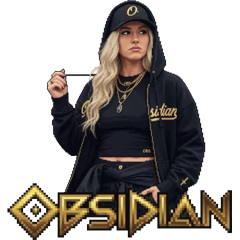
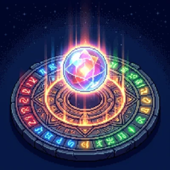
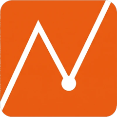
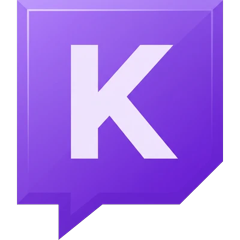

  
  
  

### Sobre mí

Desarrollador de software con más de 6 años de experiencia profesional en **PHP y JavaScript**, desde soluciones a
medida para distribuidoras de electricidad y gas hasta aplicaciones internas full-stack. Ahora llevo mis propios
productos **de la idea a producción**: una tienda full-stack, un juego publicado en Google Play, un asistente de IA
para Windows y varias apps web desplegadas.

Me importa lo que no se ve en una demo: la seguridad, el rendimiento medido, los tests y que el producto aguante en
manos de usuarios reales.

 

## Proyectos destacados

<table>
  <tr>
    <td width="33%" align="center" valign="top">
      
      <h3>Obsidian</h3>
      E-commerce full-stack de streetwear: catálogo Laravel, autenticación Sanctum, carrito y wishlist sincronizados y checkout con pedidos reales.
        
      <code>React</code> <code>TypeScript</code> <code>Laravel</code> <code>MySQL</code>
        
      <a href="https://obsidian.aleixaj.com"><b>Demo</b></a> · <a href="https://github.com/AleixAj/obsidian">Código</a>
    </td>
    <td width="33%" align="center" valign="top">
      
      <h3>Orbex</h3>
      Juego arcade estilo Zuma con 10 mundos y 80 niveles en pixel art hecho a mano. Ranking online, telemetría y anti-trampas con Supabase.
        
      <code>Godot</code> <code>GDScript</code> <code>Supabase</code> <code>PostgreSQL</code>
        
      <a href="https://play.google.com/store/apps/details?id=com.aleix.orbex"><b>Google Play</b></a> · <a href="https://kylen02.itch.io/orbex">Jugar</a> · <a href="https://github.com/AleixAj/orbex-web">Web</a>
    </td>
    <td width="33%" align="center" valign="top">
      
      <h3>NEXUS</h3>
      Asistente de escritorio al estilo J.A.R.V.I.S.: agente de IA con 46 herramientas, voz, frase de activación sin conexión y fondo de escritorio animado.
        
      <code>Electron</code> <code>TypeScript</code> <code>React</code> <code>AI Agents</code>
        
      <a href="https://github.com/AleixAj/nexus/releases/latest/download/NEXUS-Setup.exe"><b>Descargar</b></a> · <a href="https://github.com/AleixAj/nexus">Código</a>
    </td>
  </tr>
  <tr>
    <td width="33%" align="center" valign="top">
      
      <h3>Waymark</h3>
      Tus fotos de viaje sobre un globo 3D: lee el GPS, detecta los viajes solo y se sincroniza con tu Google Drive, sin servidor.
        
      <code>SvelteKit</code> <code>TypeScript</code> <code>MapLibre</code> <code>Web Workers</code>
        
      <a href="https://waymark.aleixaj.com"><b>Demo</b></a> · <a href="https://github.com/AleixAj/waymark">Código</a>
    </td>
    <td width="33%" align="center" valign="top">
      
      <h3>Nadir</h3>
      Monitor de precios full-stack: compara tiendas, guarda el histórico y avisa por email cuando baja del precio objetivo.
        
      <code>Next.js</code> <code>TypeScript</code> <code>PostgreSQL</code> <code>Drizzle</code>
        
      <a href="https://nadir.aleixaj.com"><b>Demo</b></a> · <a href="https://github.com/AleixAj/nadir">Código</a>
    </td>
    <td width="33%" align="center" valign="top">
      
      <h3>Kylen Chat</h3>
      App para streamers con una sola pantalla: el chat de Twitch transparente encima del juego, con emotes y perfiles por juego.
        
      <code>Electron</code> <code>JavaScript</code> <code>Node.js</code> <code>WebSocket</code>
        
      <a href="https://github.com/AleixAj/kylenchat/releases/latest/download/KylenChat-Setup.exe"><b>Descargar</b></a> · <a href="https://github.com/AleixAj/kylenchat">Código</a>
    </td>
  </tr>
</table>

Más proyectos, con capturas y detalles técnicos, en <a href="https://aleixaj.com"><b>aleixaj.com</b></a>

 

## Tecnologías

  
  
  
  
  
  

  
  
  
  
  
  

  
  
  
  
  
  

  
  
  
  
  

 

## Trayectoria

| Periodo | Puesto | Dónde |
| --- | --- | --- |
| 2026 – hoy | Desarrollo de producto y formación | Proyectos propios |
| 2025 – 2026 | Desarrollador de Software (full-stack, PHP y JavaScript) | Grup Romeu |
| 2023 – 2025 | Desarrollador de Software (PHP, sector energético) | Nemon |
| 2019 – 2023 | Release Manager y Desarrollador de Software | VIEWNEXT |

 

  ¿Hablamos? Escríbeme a <a href="mailto:aleixauque@gmail.com">aleixauque@gmail.com</a> o por <a href="https://linkedin.com/in/aleixauque/">LinkedIn</a>.

