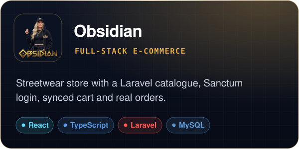
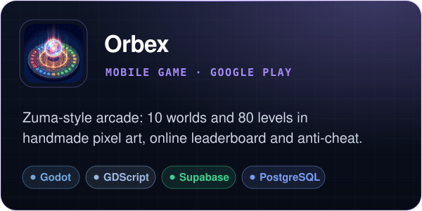
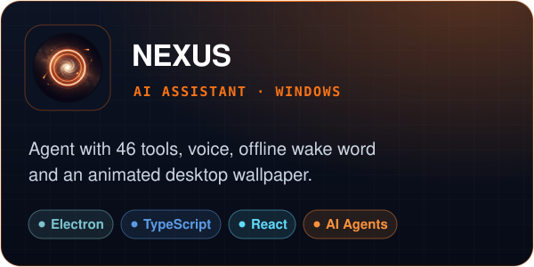
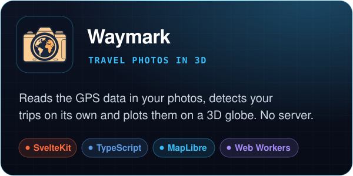
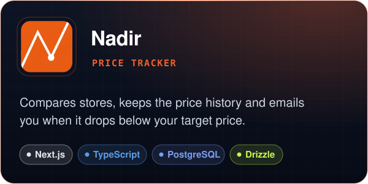
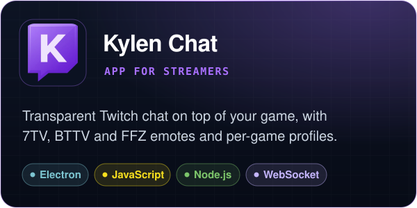
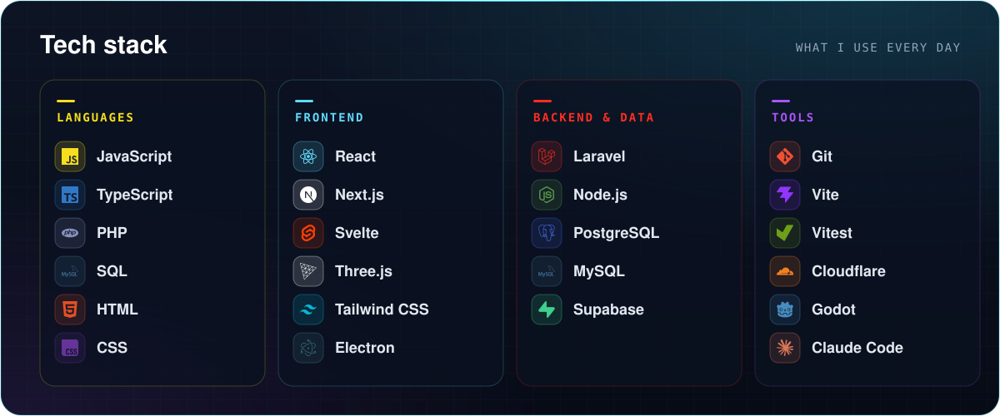
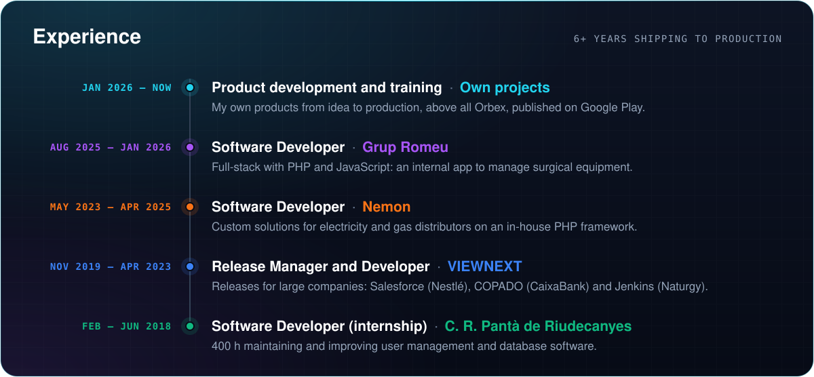
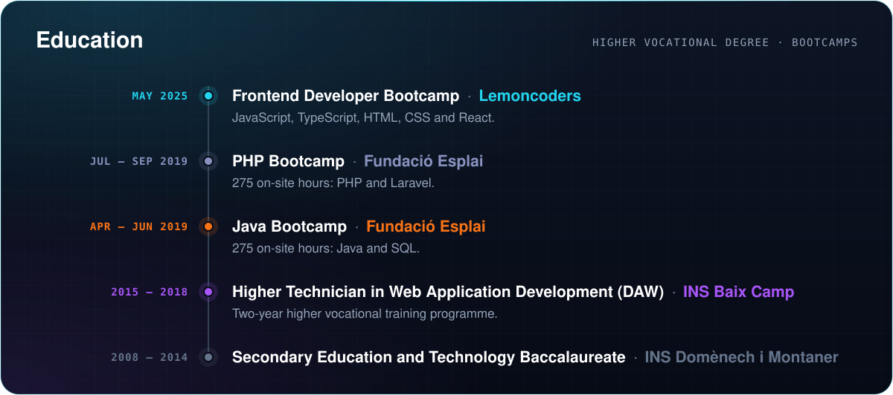

<b>English</b> · <a href="README.es.md">Español</a>

  
  
  

### About me

Software developer with 6+ years of professional experience, working with **PHP and JavaScript**, from custom
solutions for electricity and gas distributors to full-stack internal apps. Now I take my own products **from idea
to production**: a full-stack store, a game published on Google Play, an AI assistant for Windows and several
deployed web apps.

I care about what a demo doesn't show: security, measured performance, tests, and a product that holds up in the
hands of real users.

 

## Featured projects

  
  
   
   
  &nbsp;&nbsp;
   

  
  
   
   
  &nbsp;&nbsp;
   

  
  
   
   
  &nbsp;&nbsp;
   

More projects, with screenshots and technical details, at <a href="https://aleixaj.com"><b>aleixaj.com</b></a>

   
   
  

<b>Let’s talk</b>

  
  
  

